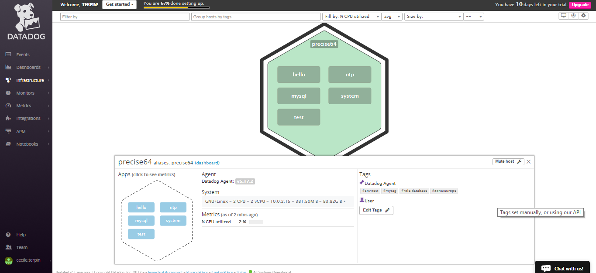
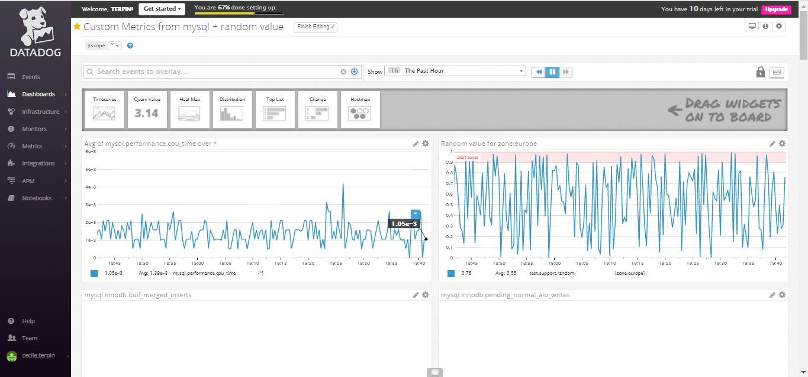
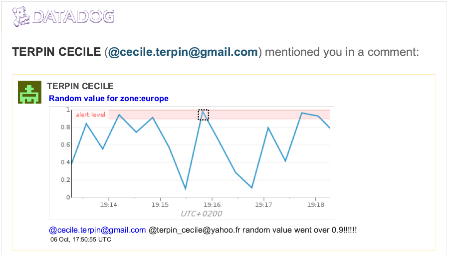
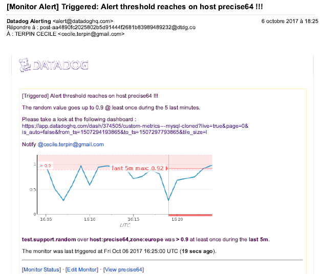
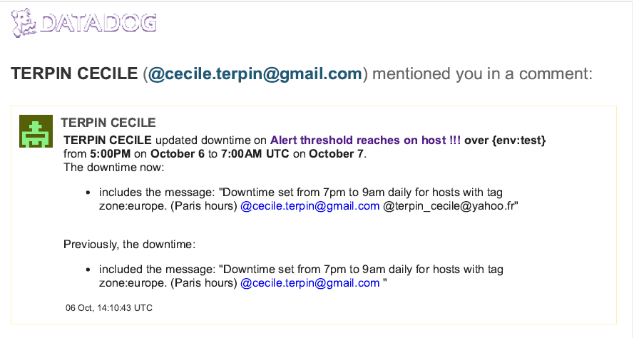
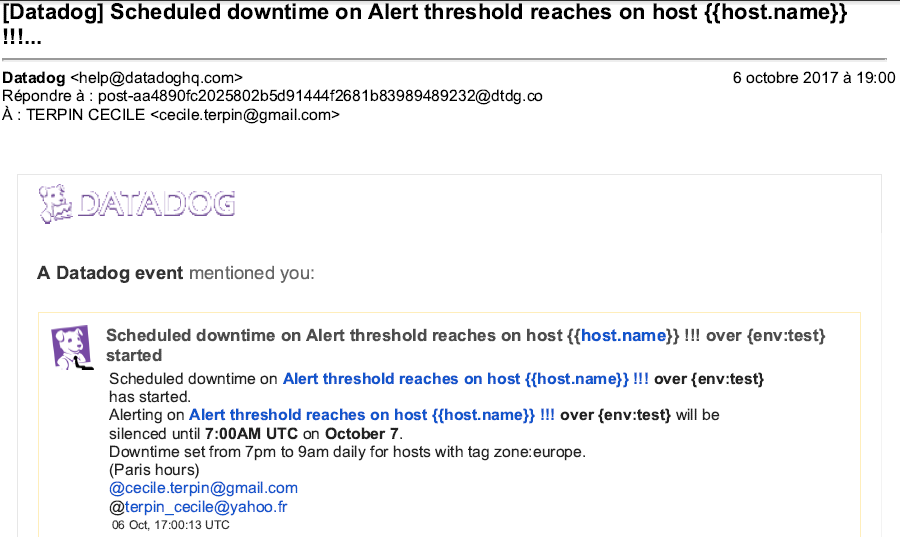

Try to skip level 0 but fail
=================
I tried to install the datadog agent on my laptop, its OS is Windows 10 family version.
The agent was running but no data were sent to datadog website.
I looked at the log file C:\ProgramData\Datadog\logs\collector.log.
Found an error from a python file, looked at the python script, modified my registry keys.
I stopped and restarted the agent, the error in the collector disappeared but the collector process kept on dying.
This led to ticket 111118 on Datadog support database. I used the flare command to send configuration and logs.
As the datadog team told me it was a known bug, I set up an Ubuntu VM using virtual Box and Vagrant 
to be able to go on with the exercice.

Level 1 - Collecting the Data:
=================
* Installation of the agent metrics on ubuntu using the following command line (with curl already on the machine):   
 *DD_API_KEY=<PERSONAL_API_KEY> bash -c "$(curl -L https://raw.githubusercontent.com/DataDog/dd-agent/master/packaging/datadog-agent/source/install_agent.sh)"*

   Check the agent status:   
   *sudo service datadog-agent status*

* Bonus question: In your own words, what is the agent?  
   An agent is a configurable process that collect tagged data from the computer it's running on and send them to Datadog website
   where the user can rearrange them and display them in a useful way to monitor his machines.

* Add tags to the agent:   
   Adding tags to all metrics coming from this machine using the agent configuration file  ( */etc/dd-agent/datadog.conf*) :   
   *# Set the host's tags (optional)   
   tags: mytag, env:test, role:database, zone:europe*      
   
   Restart the agent to reload the configuration files:    
   *sudo /etc/init.d/datadog-agent restart*   
   
   HostMap page:   
   [HostMap page with tags - link] (https://app.datadoghq.com/infrastructure/map?fillby=avg%3Acpuutilization&sizeby=avg%3Anometric&groupby=none&nameby=name&nometrichosts=false&tvMode=false&nogrouphosts=false&palette=green_to_orange&paletteflip=false)   
     

* Installation of mySQL on the ubuntu VM. 
   Try to connect with mysql on ubuntu then to get access to the database from my local machine with sql developper.  
   Create the datadog user, and give him the required rights for its job, in my database, using the following instructions:  

		CREATE USER 'datadog'@'localhost' IDENTIFIED BY '<PERSONNAL_PASSWORD>';
		GRANT REPLICATION CLIENT ON *.* TO 'datadog'@'localhost' WITH MAX_USER_CONNECTIONS 5;
		GRANT PROCESS ON *.* TO 'datadog'@'localhost';
		#Check if performance_schema is available
		show databases like 'performance_schema';
		GRANT SELECT ON performance_schema.* TO 'datadog'@'localhost';

   Then, go back to the ubuntu machine to add mysql metrics to the data sent to Datadog by creating the following mysql.yaml in the Agent’s conf.d directory :   

		init_config:

		instances:
		  - server: localhost
		    user: datadog
		    pass: **********
		    port: 3306
		    options:
			replication: 0
			galera_cluster: 1
			extra_status_metrics: true
			extra_innodb_metrics: true
			extra_performance_metrics: true
			schema_size_metrics: false
			disable_innodb_metrics: false
		
   Restart the agent so the configuration is taken into account:   
  *sudo /etc/init.d/datadog-agent restart*   

* Custom agent check:
   This needs a configuration file in etc/dd-agent/conf.d/ and a python file in /etc/dd-agent/checks.d/.   
   random.yaml file:   

		init_config:

		instances:
		    [{}]

   random.py file:  

		from checks import AgentCheck
		import random
		class RandomCheck(AgentCheck):
			def check(self, instance):
				a =random.random()
				self.gauge('test.support.random', a)

   Restart the agent
   *sudo /etc/init.d/datadog-agent restart*   

--------------------------------------------------------------------------------
Level 2 - Visualizing your Data
=================

* Clone the database integration dashboard and add test.support.random metric and some other metrics.  
 
   [mysql Dashboard - link] (https://app.datadoghq.com/dash/374505/custom-metrics-from-mysql--random-value?live=true&page=0&is_auto=false&from_ts=1507308194252&to_ts=1507311794252&tile_size=l)   
     

* Bonus question: What is the difference between a timeboard and a screenboard?  
   A timeboard has a fixed layout and shows time-synchronized data, its purpose is to analyze correlation and problems.   
   Screenboard has a very flexible layout, can include various widgets and its purpose is more high-level communication. We can assign it a public url.    

* Email from snapshot comment:   

     

Level 3 Alerting on your data
=================

    

  As I didn't receive an email for the monitor I set, I add another email address to alert and therefore, receive an email on this address for the update.  
    

     

